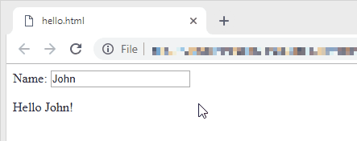

# Refresh

A refreshing way to DOM templating.

Write this...

```javascript
<script src="https://gitcdn.xyz/repo/audinue/refresh/v1.0.0/refresh.min.js"></script>
<script>
    var name = 'John'
</script>

<p>Name: <input value="{name}" oninput="name=this.value"></p>
<p>Hello {name}!</p>
```

And you got this...



Visit the [playground](https://gitcdn.xyz/repo/audinue/refresh/master/playground.html) to learn more.

## Notes

- Call `refresh()` to update the DOM outside of HTML.
- `<p align="{align}">Hello {name}!</p>`
- `this` refers to the owning element.
- `<tag for="value[, key] in expression"></tag>` creates new scope.
- `<tag if="expression"></tag>`
- `safe-*` for edge-cases like `<input type="number" safe-value="{foo}">`
- Two way data binding:
    - `value-source="expression"` also works for `<select>` for WebKit only.
    - `checked-source="expression"` accepts boolean and array.
- Handle `autofocus` well.
